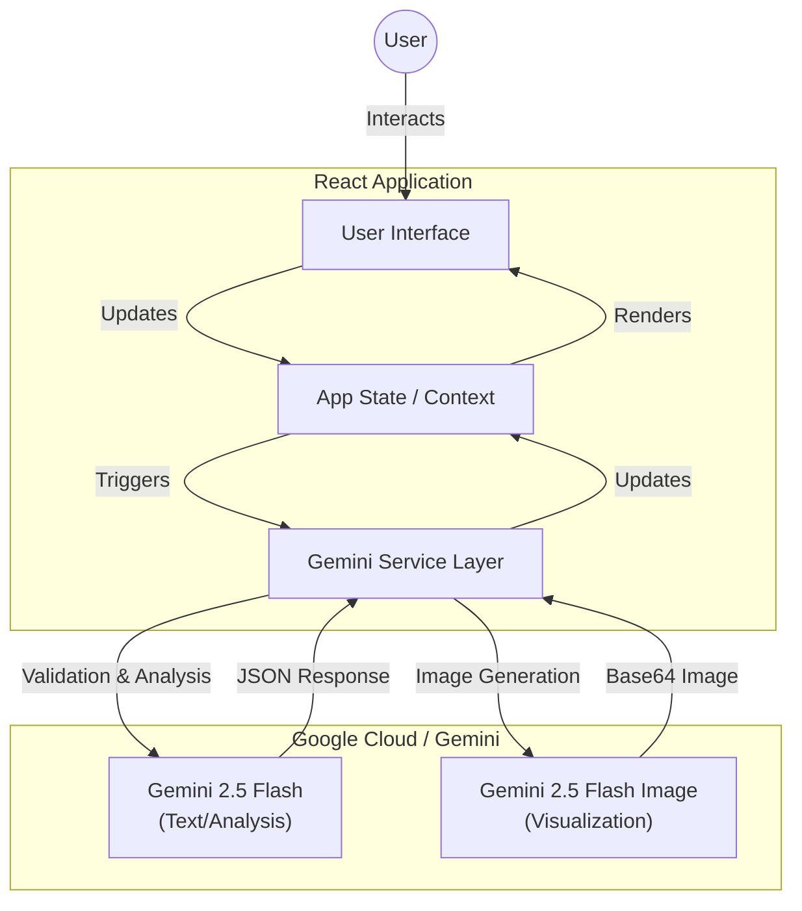
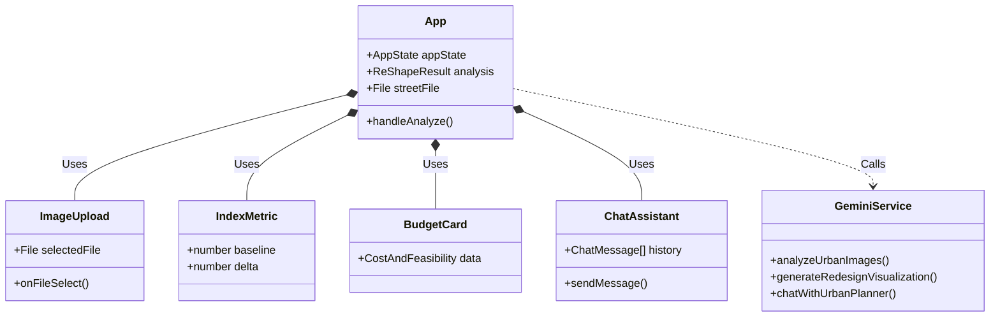

# Architecture Documentation

ReShape City AI is a client-side React application that leverages the Google Gemini API for complex multimodal reasoning and image generation.

## 1. System Overview

The application follows a standard Single Page Application (SPA) architecture. It maintains no backend database; all state is transient and lives in the React client, while heavy computational logic (computer vision, urban planning analysis, rendering) is offloaded to the Gemini API.

## 2. Component Hierarchy

The UI is built using functional React components. `App.tsx` serves as the main controller, managing the finite state machine (`UPLOAD` -> `ANALYZING` -> `DASHBOARD`).

## 3. Analysis & Generation Sequence

This diagram illustrates the flow of data when a user triggers an analysis. Note the two-step process: first obtaining the structured analysis (JSON), and then lazily or immediately fetching the visualization based on the generated prompts.

```mermaid
sequenceDiagram
    actor User
    participant UI as App Component
    participant Service as Gemini Service
    participant Gemini as Google GenAI SDK

    User->>UI: Upload Street & Satellite Images
    User->>UI: Selects Persona & Goal
    User->>UI: Clicks "Generate Inclusive Plan"
    
    rect rgb(30, 36, 43)
        note right of UI: Phase 1: Text & Metric Analysis
        UI->>Service: analyzeUrbanImages(files, context)
        Service->>Gemini: Prompt: "Analyze spatial metrics & propose redesigns" (Multimodal)
        Gemini-->>Service: Returns JSON (ReShapeResult)
        Service-->>UI: Updates State (Analysis Data)
    end
    
    UI->>User: Displays Dashboard (Existing View)
    
    rect rgb(46, 57, 68)
        note right of UI: Phase 2: Visualization
        UI->>Service: generateRedesignVisualization(prompt_from_json)
        Service->>Gemini: Prompt: "Photorealistic render of..." + Reference Image
        Gemini-->>Service: Returns Base64 Image
        Service-->>UI: Updates State (Proposed Image)
    end
    
    User->>UI: Toggles "Proposed" View
    UI->>User: Renders Generated Redesign
```

## 4. Data Models

The application relies on a strict schema returned by the AI to populate the dashboard.

*   **Context**: Location guesses and user goals.
*   **BaselineAnalysis**: Spatial metrics (width, lanes), visual summary, and standard urban indices (0-100).
*   **RedesignLevels**: A progressive array of interventions (Level 0 to Level 100).
*   **CostAndFeasibility**: Rough order-of-magnitude estimates and heatmap data.
*   **SocialImpact & Climate**: Simulation data for specific scenarios (Heatwaves, Flooding).

## 5. Key Design Decisions

1.  **Prompt Engineering vs. Fine-tuning**: The app uses "In-Context Learning" with long system instructions rather than fine-tuned models to maintain flexibility and keep costs low.
2.  **JSON Mode**: We strictly enforce `responseMimeType: "application/json"` in the Gemini API to ensure the frontend never breaks due to unstructured text.
3.  **Client-Side Processing**: Files are converted to Base64 in the browser (`fileToPart` in `geminiService.ts`) and sent directly to the API, preserving privacy by not storing images on an intermediate server.