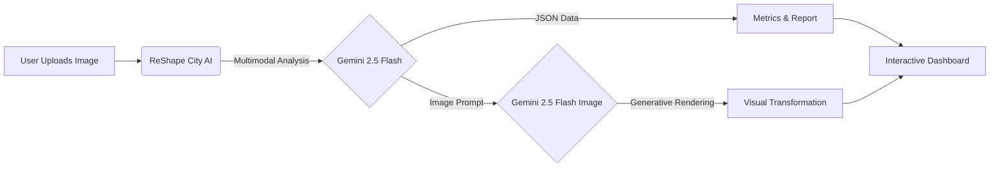

# ReShape City AI 🏙️

**ReShape City AI** is a professional, multimodal AI dashboard designed to revolutionize preliminary urban design and city planning. By analyzing street-level and satellite imagery, it generates comprehensive reports, inclusivity-focused redesigns, and realistic visualizations of transformed urban spaces using the Google Gemini API.

[](https://aistudio.google.com/apps/drive/1sWtrK84i3JC6sYjL2Qbznz0-XtfA3WSv?fullscreenApplet=true&showPreview=true&showAssistant=true)




## 🚀 Key Features

*   **Multimodal Analysis**: Upload street view and satellite images to get a holistic analysis of existing conditions (traffic, density, green space).
*   **Inclusive Design Engine**: Switch between user personas (e.g., *Wheelchair User*, *Cyclist*, *Parent with Stroller*) to identify specific barriers and generate inclusive solutions.
*   **Visual Transformation**: Uses Generative AI to visualize the "After" state of the street based on selected design strategies (e.g., *Max Greenery*, *Pedestrian Only*).
*   **Planning Dashboard**:
    -   **Metrics**: Estimates changes in Floor Area Efficiency and Public Open Space.
    -   **Solar Analysis**: Provides sun exposure data and shade strategies.
    -   **Benefits**: Quantifies improvements in walkability, shade coverage, and safety.
*   **Interactive Assistant**: A built-in "City Chat" bot allowing users to ask specific questions about the design, feasibility, or regulations.
*   **Rendering Styles**: Choose visual output styles ranging from *Photorealistic* to *Watercolor Sketch* or *Blueprint*.

## 🏗️ Architecture

For a deep dive into the component hierarchy and data flow, please see [ARCHITECTURE.md](./ARCHITECTURE.md).

## 🛠️ Tech Stack

*   **Frontend**: React 19, TypeScript
*   **Styling**: Tailwind CSS
*   **AI Models**: Google Gemini 2.5 Flash & Flash-Image (via `@google/genai` SDK)
*   **Visualization**: Recharts (Graphs), html2canvas & jspdf (PDF Export)
*   **Icons**: Lucide React

## 📦 Getting Started

### Prerequisites

-   Node.js installed.
-   A Google Gemini API Key.

### Installation

1.  Clone the repository:
    ```bash
    git clone https://github.com/yourusername/urban-planner-ai.git
    ```
2.  Install dependencies:
    ```bash
    npm install
    ```
3.  Set up your API Key:
    -   Ensure `process.env.API_KEY` is accessible or configure it in your environment.

4.  Run the development server:
    ```bash
    npm start
    ```

## 🎮 How to Use

1.  **Upload Images**: Drag and drop a street-level photo and/or a satellite map view.
2.  **Configure Context**:
    -   **Persona**: Who are we designing for? (e.g., Elderly Resident).
    -   **Focus**: What is the goal? (e.g., Night Economy).
    -   **Style**: How should the result look? (e.g., Watercolor).
3.  **Generate**: Click "Generate Inclusive Plan".
4.  **Explore**:
    -   Review the "Existing" vs "Proposed" visual slider.
    -   Analyze the metrics and identified problems on the left/right panels.
    -   Use the **Chat Assistant** (bottom right) to ask questions.

---

*Built with ❤️ using Google Gemini API.*
